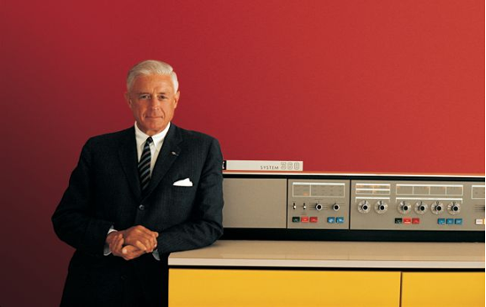

这一章回顾了虚拟化技术的发展历史及常见的应用场景，你可以选择感兴趣的章节进行阅读，希望可以给你带来一些启发。

## 技术起源

让我们将时间线回溯到 1964 年，故事要从 IBM 的 System/360 讲起。

这是一款大型计算机，但贡献了很多对后续计算机发展由深远影响的设计。比如对于体系结构的定义，对通用操作系统的定义。在这款产品上，首次提出了软件一次开发，可以在多个平台上部署运行。

从软件的角度来讲，虚拟化的诞生，正是从软件接口的设计演化而来的，所以早期的虚拟化方案，一般是软件实现，后面为了性能考虑，过渡到硬件实现。这也是一个软件功能影响硬件设计的典范之一 (下图是 System/360 的首席架构师 Gene Amdahl)。

## 发展历史

现在我们以 System/360 为出发点，梳理了三条虚拟机技术的发展线，非常有意思：

### 高效利用硬件资源

在计算机技术的发展初期，硬件资源的稀缺性决定了其服务模式以 ToB（企业级）为主。为了最大化单台设备的产出效益，避免硬件资源闲置。这种需求催生了"多用户分时系统"的概念——通过时间片轮转机制，让多用户共享同一台计算机资源。这一技术突破不仅实现了硬件的复用，更奠定了现代操作系统的雏形。随着应用场景的复杂化，单机上运行多个独立操作系统的诉求逐渐显现，这直接推动了虚拟化技术的诞生。

1990 年代末期，随着个人电脑的普及，VMware Workstation 作为首个成熟的商业虚拟化解决方案崭露头角。它通过在宿主操作系统上构建虚拟机监控器（Hypervisor），实现了 Windows 与 Linux 等异构系统的并行运行。这一时期的技术突破体现在两个维度：硬件抽象层的构建（如 VT-x 指令集的支持）和客户机操作系统的兼容性优化。开源社区则贡献了 Xen 这样的半虚拟化方案，其通过 Para-virtualization 技术要求修改客户机内核以获得更高性能，这种设计在服务器领域展现出独特优势。

2007 年 KVM（Kernel-based Virtual Machine）的诞生标志着虚拟化技术的范式转移。作为 Linux 内 核的模块化扩展，KVM 将硬件虚拟化能力直接嵌入操作系统核心，消除了传统 Hypervisor 架构的性能损耗。这种"基于内核的虚拟化"方案完美契合了 Linux 的模块化设计理念，使其在云计算时代具备先天优势。据统计，当前全球超过 80% 的云服务提供商采用 KVM 作为底层虚拟化平台，其裸金属性能损耗低于 5% ，远超同期商业解决方案。

在云计算时代，虚拟化技术已从辅助工具进化为核心基础设施。通过动态资源调度算法（如 OpenStack 的 Heat 编排引擎），云平台能够根据实时负载自动分配 CPU、内存和存储资源。这种弹性架构不仅将硬件利用率从传统数据中心的 30% 提升至 80% 以上，更催生了按需付费的新型商业模式。当前，KVM 与容器技术（如 Docker）的深度整合，正在推动**"虚拟化 + 容器化"**的混合架构发展，为边缘计算和 AI 算力调度提供新的解决方案。

!!! note

    值得关注的是，虚拟化技术的演进始终遵循"硬件抽象-资源隔离-效率优化"的技术路径。从早期的分时系统到现代的云原生架构，每一轮技术革新都在重新定义硬件资源的利用边界。随着量子计算和光子芯片等新型硬件的出现，虚拟化技术正面临新的挑战与机遇，其发展轨迹将持续影响未来计算范式的演进方向。

### 模拟与跨平台

UCSD p-System（1970-1980 年代）作为跨平台技术的先驱，基于自研的 Pascal 语言，通过生成中间字节码实现跨平台兼容性，实现了应用程序在不同硬件平台上的可移植性。这种设计思路不仅简化了软件开发流程，还为后续的虚拟机技术奠定了基础。尽管 UCSD p-System 最终未能成为主流，但它开创的跨平台理念对后来的技术发展产生了深远影响。

这种利用中间字节码实现跨平台的技术，后续发展为高级语言实现跨平台的重要技术之一。同时，这也是实现高性能模拟器的重要技术之一。

我们接着聊聊模拟器。

进入 1990 年代末至 2000 年代初，随着个人电脑的普及和互联网的兴起，PC 模拟器应运而生。这类工具允许用户在一台机器上模拟其他类型的计算机系统，从而运行原本不兼容的操作系统和应用软件。Bochs 作为其中的代表，提供了一个完整的 x86 架构仿真环境，支持 Windows、Linux 等多种操作系统。Bochs 不仅在教育和研究领域发挥了重要作用，也为开发者提供了测试和调试跨平台应用的便捷手段。

另外便是 QEMU 开源项目的发起，它是跨平台/模拟器技术发展史上极为关键的一环，它的出现不仅填补了开源虚拟化与系统模拟之间的空白，更成为现代云计算、嵌入式开发和跨平台兼容性解决方案的基石之一。

2003 年，法布里斯·贝拉（Fabrice Bellard）发布了 QEMU（Quick Emulator），这是一款革命性的开源模拟器，彻底改变了跨平台技术的格局。QEMU 的核心创新在于其动态二进制翻译技术（Dynamic Binary Translation），它能够将目标架构的机器指令实时翻译成本地 CPU 指令，从而实现接近原生的执行速度。

!!! note

    QEMU 后来与 Linux 内核的 KVM 模块紧密结合，形成 “KVM + QEMU” 虚拟化组合。在这种架构中，KVM 提供硬件加速的虚拟化支持，而 QEMU 负责设备模拟和 I/O 处理，二者协同工作，成为 OpenStack、Proxmox 等主流云平台的底层引擎。

### 微架构仿真

Virtutech Simics 是一款全系统模拟器，最初由瑞典皇家理工学院的研究人员开发，并于 1988 年商业化。Simics 的核心优势在于其高度精确的硬件模拟能力和对多核、多处理器系统的支持。它能够模拟从单个 CPU 到大规模并行计算集群的各种硬件配置，包括内存子系统、I/O 设备和网络接口等。

Simics 后期加入了时序建模能力（timing models），但其默认模式仍是“功能准确 + 近似时序”，不追求 cycle-accurate 级别的精度。

让我们把视角再次转回到开源世界：

GM（General Execution-driven Multiprocessor Simulator）和 GEMS（General Execution-driven Multiprocessor Simulator）是由威斯康星大学麦迪逊分校开发的一系列高性能多处理器模拟器。它们专注于模拟大规模并行系统的内存子系统和缓存层次结构。

GEMS 的核心贡献之一就是构建了一个高度可配置、支持细粒度建模的多处理器内存系统仿真框架。而 GM 主要是处理器方面。

gem5 是一个开源的全系统模拟器，由卡内基梅隆大学的研究人员开发并于 2006 年发布。gem5 继承了 GM/GEMS 的许多优点，并在此基础上进行了扩展和改进，成为当前最广泛使用的体系结构模拟器之一。

## 应用场景

虚拟化技术的应用领域非常广泛。为了方便展示，我将其总结成了一张表格：

|      application      |    desc   |
|         :---:         |    ----   |
|      云上基础设施      | 虚拟化是现代云计算的基石。通过 KVM、Xen、VMware ESXi 等虚拟化技术，云服务提供商（如 AWS EC2、阿里云 ECS、Google Compute Engine）能够在物理服务器上运行多个相互隔离的虚拟机（VM），实现资源的弹性分配、按需计费和快速部署。结合容器技术（如 Docker + Kubernetes），云平台进一步发展出轻量级虚拟化（如 Kata Containers、Firecracker）和 Serverless 架构，提升资源利用率与安全性。虚拟化还支持热迁移、快照、高可用（HA）等关键功能，保障业务连续性。 |
|      桌面虚拟机        | 桌面虚拟化允许用户在一台物理主机上同时运行多个操作系统环境，广泛应用于开发测试、教育、跨平台办公等场景。典型工具如 VMware Workstation、VirtualBox、Parallels Desktop 等，支持在 Windows 上运行 Linux，在 Mac 上运行 Windows，或在 Linux 上运行各类测试系统。它提供了沙箱环境，便于软件兼容性测试、安全演练和系统恢复。企业级桌面虚拟化（VDI，Virtual Desktop Infrastructure）还可集中管理数千个虚拟桌面，提升 IT 运维效率与数据安全性。 |
|      嵌入式虚拟化      | 在汽车电子（如智能座舱与自动驾驶域控制器）、工业控制、物联网设备中，嵌入式虚拟化（如 ACRN、Xen、KVM on ARM）允许多个异构操作系统共存于同一 SoC 上。例如，一个虚拟机运行实时操作系统（RTOS）处理传感器控制，另一个运行 Linux 或 Android 提供车载娱乐功能。这种“混合关键性系统”（Mixed-Criticality Systems）通过硬件辅助虚拟化（如 ARM Virtualization Extensions）实现资源隔离与时间确定性，满足功能安全（ISO 26262）与信息安全双重需求。 |
|      体系结构模拟器    | 体系结构模拟器（如 QEMU、Simics）通过软件模拟不同 CPU 架构（x86、ARM、RISC-V、PowerPC 等）的行为，实现跨平台程序运行与系统开发。QEMU 使用动态二进制翻译技术，在 x86 主机上高效运行 ARM 程序；Simics 则提供全系统确定性仿真，支持芯片流片前的固件与驱动验证。这类工具广泛用于操作系统移植、嵌入式开发、旧系统迁移和教学实验，是软硬件协同设计的关键支撑。 |
|      微架构性能模拟器  | 面向计算机体系结构研究，微架构模拟器（如 gem5、GEMS）可对处理器流水线、缓存层次、分支预测、内存子系统等进行 cycle-accurate（周期精确）建模。研究人员利用这些工具探索新型 CPU 设计（如 RISC-V 扩展、AI 加速器集成）、评估缓存一致性协议（MESI、MOESI）、分析多核争用与性能瓶颈。其输出为详细的性能指标（L1 miss rate、IPC、NoC latency），是发表顶会论文（ISCA、MICRO）的核心工具。 |
|      安卓模拟器        | 安卓模拟器（如 Android Studio 内置的 AVD、Genymotion、BlueStacks）基于 QEMU 或定制虚拟化技术，允许开发者在 PC 上运行完整的 Android 系统，用于应用开发、测试与调试。现代安卓模拟器支持 GPU 加速、传感器模拟（GPS、加速度计）、网络条件模拟，并可运行 Google Play 服务。部分商业模拟器（如 BlueStacks）还面向普通用户，实现安卓游戏在 Windows/Mac 上的高性能运行，形成“移动 + 桌面”融合体验。 |
|      游戏机模拟器      | 游戏机模拟器（如 Dolphin（Wii/GameCube）、PCSX2（PS2）、RPCS3（PS3）、Citra（3DS））通过高度精确的硬件模拟，复现经典游戏主机的 CPU、GPU、音频与外设行为，使老游戏可在现代 PC 或移动设备上运行。这类模拟器通常结合动态编译、图形 API 转换（如将 GameCube 的 GX 转为 Vulkan）和时序修复技术，实现超分辨率渲染、帧率提升等“超越原机”的体验。它们在游戏 preservation（数字遗产保存）、逆向工程和怀旧娱乐中具有重要价值。|
|      嵌入式硬件模拟器  | 专用于嵌入式系统开发的虚拟平台（如 Wind River Simics、QEMU for embedded），可模拟特定 SoC（如 NXP i.MX、TI AM335x）、开发板及外设（UART、I2C、SPI、CAN 总线）。工程师可在硬件尚未就绪时提前开发驱动、操作系统和应用软件，显著缩短产品上市周期。这类模拟器支持多节点协同仿真（如汽车 ECU 网络）、故障注入测试和回归验证，广泛应用于航空航天、医疗设备、通信基站等领域。 |
|      高级语言虚拟机    | 高级语言虚拟机（如 JVM、.NET CLR、V8 JavaScript Engine、WebAssembly Runtime）提供语言无关的运行时环境，实现“一次编写，到处运行”。JVM 将 Java 字节码翻译为本地指令，支持垃圾回收、即时编译（JIT）、安全管理；WASM 则在浏览器中提供接近原生性能的沙箱执行环境，支持 C/C++/Rust 等语言运行于 Web。这类虚拟机通过抽象底层硬件差异，提升开发效率与跨平台兼容性，是现代软件生态的核心基础设施。 |
